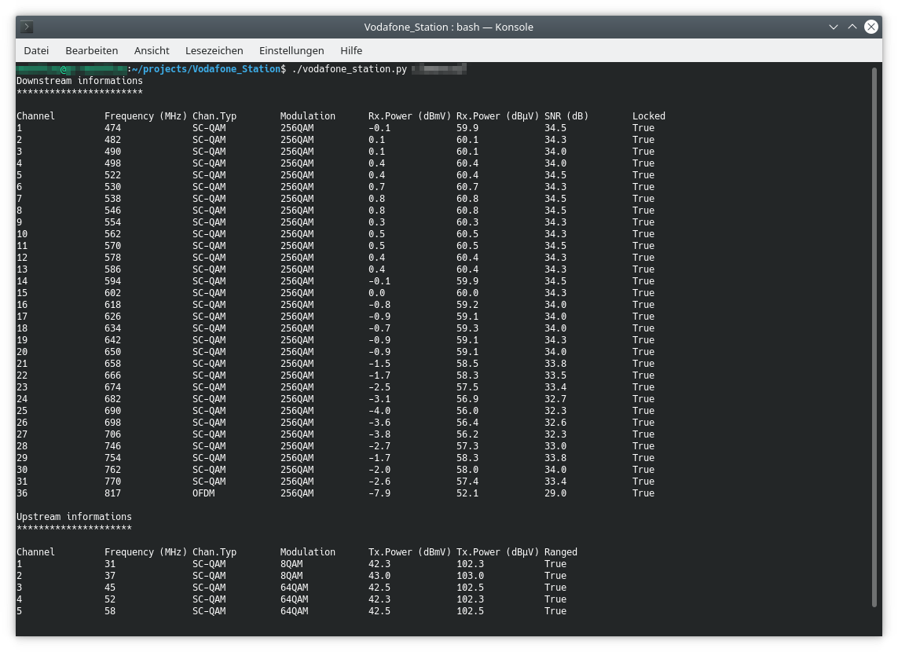

# Vodafone Station Read
Read DOCSIS status data from Arris TG3442DE ("Vodafone Station" in Germany)

<b>usage:</b> vodafone_station.py password

This python script connects to the web interface of the Arris TG3442DE, performs a login and grabs the DOCSIS status data (downstream and upstream parameters). The unique argument is the router web interface password without quotes.

The script requires :
  - Python
  - Selenium (and dependencies)
  - Firefox
  - Geckodriver
  
The script has been tested with firmware 01.02.037.03.12.EURO.SIP in following environments :
  - Linux (KDE Neon 2019.07.04-1120 x86-64), Python 3 (3.6.9), Selenium (3.141.0), Firefox (74.0), Geckodriver (74.0.1)
  - Windows 7 (x86), Python 3 (3.8.2), Selenium (3.141.0), Firefox (74.0.1), Geckodriver (71.0.0.7222)
  
Due to the complex code structure of the router's web interface and the usage of javascript in the login process, the script uses the selenium webdriver. The browser used with Selenium is Firefox in headless (without interface) mode.

After having extracted the data from HTML dsTable (downstream table) and usTable (upstream table), the script processes the data :
  - Sorting data by channel and discarding channel 0
  - Parsing values in two 2D-arrays
  - Parsing Rx and Tx power in separate float values
 
The script creates two arrays (ds_data and us_data) with one row per channel. Each rows is formated with following scheme:
 
<b>ds_data (format)</b>
  - Channel index (int)
  - Frequency in MHz (int)
  - Channel type (string)
  - Modulation type (string)
  - Rx Power in dBmV (float)
  - Rx Power in dBµV (float)
  - SNR in dB (float)
  - Lock Status (bool)
 
<i>Note : Unlike the QAM channels, the frequency of OFDM channels is displayed as a range. The script extract the channel boundaries and display the central frequency (average value)</i>

<b>us_data (format)</b>
  - Channel index (int)
  - Frequency in MHz (int)
  - Channel type (string)
  - Modulation type (string)
  - Tx Power in dBmV (float)
  - Tx Power in dBµV (float)
  - Ranging Status (bool)
 
The script output is the downstream and upstream DOCSIS data and can be processed through pipeline to other processes. The script can be extended to other usage of the data in ds_data and us_data (e.g save to file or DB for monitoring or troubleshooting purposes).

<b>Script output sample</b>

